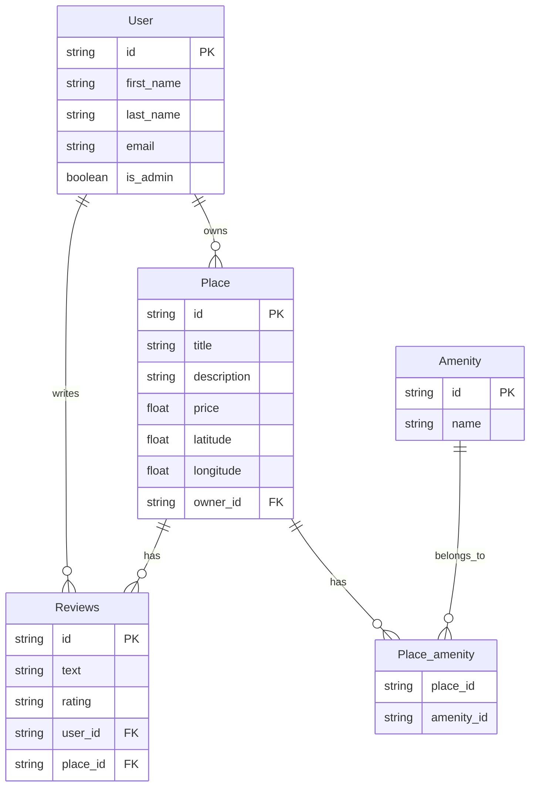

# Hbnb Part3 : Auth and API (Enhanced Backend with Authentication and Database Integration)

## Overview
1. [Previous parts](#previous-parts)
2. [Intro](#intro)
3. [Handling security](#handling-security)
4. [From inMemRepo to DB](#from-inmemrepo-to-db)
5. [Testing](#testing)

## Previous parts
In the [first part](https://github.com/sarahwcqz/holbertonschool-hbnb/tree/feature/ER_diag/part1) of the project we designed the structure of the project with UML diagrams (Package, Class and Sequence diagrams)
In the [second part](https://github.com/sarahwcqz/holbertonschool-hbnb/tree/feature/ER_diag/part2) of the project we implemented the business layer and the APIs
If you didn't read the previous part, we recommend that you start with that.

## Intro
In the previous part we work with in-memory storage to focus on the business logic and APIs. Now we will transition to SQLite and prepare the system for MySQL.
We will also implement protected endpoints, role-based acces control (user // admin) using JWT-based authentication.

## Handling security
- Include password hashing using bcrypt:
Modify the user registration endpoint to accept the password field and ensure that it is hashed before storing it. Make sure the password isn't returned in any GET requests.
- Implement JWT Authentication with flask-jwt-extended:
Set up JWT-based authentication for the HBnB application, enabling secure login functionality. Configuring the API to generate and verify JWT tokens using the flask-jwt-extended extension. Tokens will be issued upon successful login and required for accessing protected endpoints.
- Implement Authenticated User Access Endpoints:
Secure various API endpoints to allow only authenticated users to perform specific actions (creating or modifying places and reviews, updating their own user details)
- Implement Administrator Access Endpoints:
Restrict access to specific API endpoints so that only users with administrative privileges can perform certain actions. These actions include creating new users, modifying any user’s details (including email and password), and adding or modifying amenities. Additionally, administrators can perform the same tasks as authenticated users without being restricted by ownership of places and reviews.

## From InMemRepo to DB
- Implement SQLAlchemy Repository:
Replace the in-memory repository with a SQLAlchemy-based repository for persistence.
- Mapping the User, Place, Amenity and Review Entity to SQLAlchemy Model:
Ensuring the correct database relationships, attribute definitions, and CRUD operations are implemented. Incorporating the ORM functionality within the repository layer, service layer (Facade), and API layer for full integration.
- Mapping Relationships Between Entities Using SQLAlchemy:
Defining both one-to-many and many-to-many relationships and applying the appropriate constraints and foreign keys in the models.

Here is a ER diagram showing the architecture we chose for our database:

## Testing
- For the security we mainly tested on postman to make sure restricted accesses were properly protected.
- For the database you can find a [SQL directory](https://github.com/sarahwcqz/holbertonschool-hbnb/tree/develop/part3/sql) containing a script to create the DB with the chosen architecture, a script to insert initial datas in the created tables, and a script to test the Create, Read, Update and Delete operations.